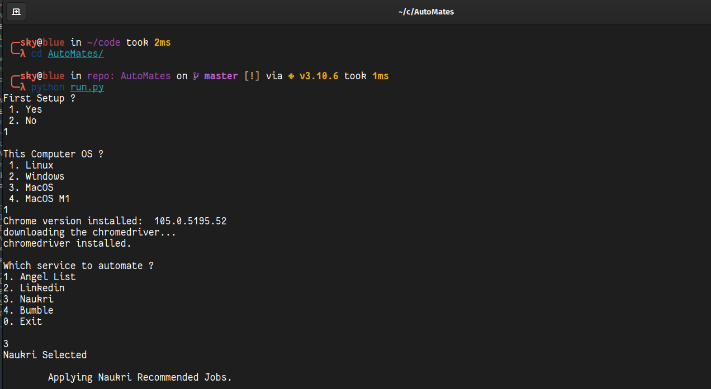

# AutoMates
Automate the finding people/jobs on Apps like LinkedIn, Bumble, AngelList.


## Setup 

Run the command to install the only package needed `selenium`.  
*Optional: Create separate python environment.*

1. `pip3 install selenium`
2. `git clone https://github.com/snapfast/AutoMates`
3. `cd Automates`
4. `python run.py`
5. Just use the menu to do things.

Note: Use pip3 or pip, python3 or python, whichever works for you. 
This program is only supported on Python 3.10 and above.

## Usage screenshots



## Usage (deprecated)

To run for specific website, choose from below commands.

### Linkedin
```python
python LINKEDIN/recommended_jobs.py  # to apply for recommended jobs in Jobs Section
python LINKEDIN/search_jobs.py "software engineer" gurgaon  # to search for jobs per location
```
### Naukari
```python
python NAUKRI/recommended_jobs.py  # to apply for recommended jobs in Jobs Section
python NAUKRI/search_jobs.py "angular developer" bangalore  # to search for jobs per location
```

### Bumble
```python
python BUMBLE/swipe.py # just right swipe only, it does a right swipe on random time, 3 secs to 13 secs.
```

### Angel List
TBD


__NOTE: RAISE ISSUE IF SOMETHING NOT WORKING ;)__

## Points to Note

There is no upload feature yet, files should be manually pre-uploaded.


